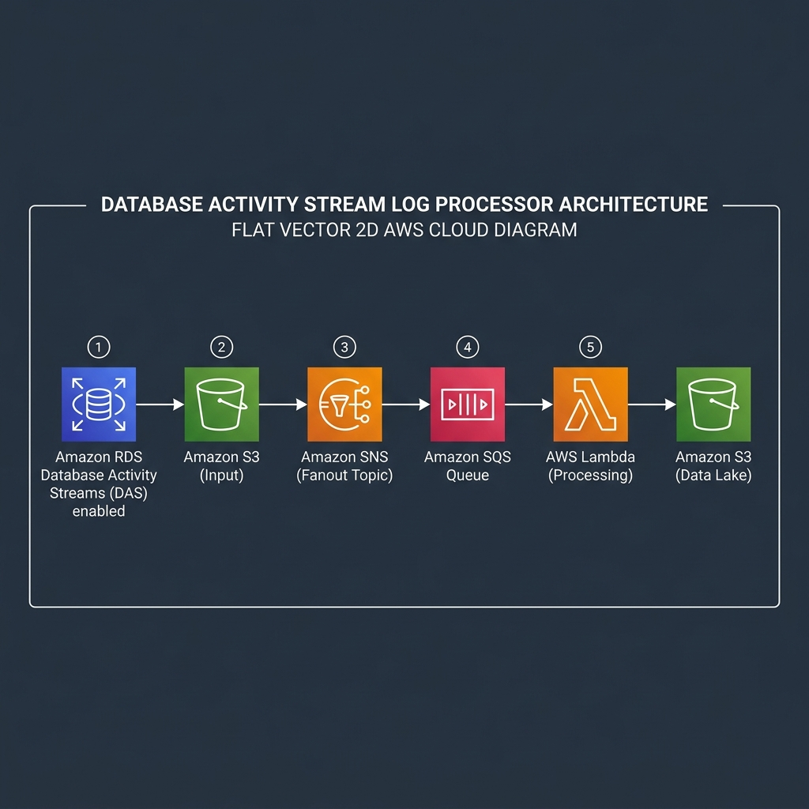

# AWS DAS Processor

## Architecture

  

## Overview & Key Features
AWS DAS Processor is a Lambda function that consumes AWS Database Activity Stream events via an SQS fanout from S3. It decrypts, decompresses, filters, and writes the stream data back to S3.

## Configuration / Environment Variables
| Variable | Default | Description |
|---|---|---|
| `DAS_FILTER_NAME` | | The specific filter stream name |
| `DAS_KMS_REGION_NAME` | | Region where the KMS key resides |
| `DAS_RDS_RESOURCE_ID` | | ID of the RDS resource for encryption context |

## IAM Permissions
Requires `s3:GetObject`, `s3:PutObject`, `kms:Decrypt`, and `sqs` operations.

## Development & Building
- Build: `make build`
- Test: `make test`

## Community Links
- [Contributing](CONTRIBUTING.md)
- [Security](SECURITY.md)

## License & Commercial Use
Licensed under the Business Source License 1.1 (BSL 1.1).

- **Non-Production Use**: Free for non-production purposes, including local development, testing, staging, QA, CI/CD automated validation, educational purposes, and proof-of-concept evaluation.
- **Production Use**: Deploying or executing in a production environment, or offering as a commercial product or hosted/managed service, requires a valid commercial license (EULA) from DIVMORA Technologies.
- **Change Date**: Converts to Apache License, Version 2.0 three (3) years from the date of release.

For commercial inquiries and enterprise licensing, please contact [licensing@divmora.com](mailto:licensing@divmora.com) or visit [divmora.com](https://divmora.com).
